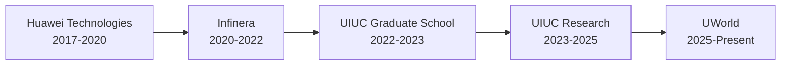

# Hi there, I'm Sristi Ingleshwar! 👋

### Software Engineer | Full-Stack Developer | GenAI Enthusiast

Welcome to my GitHub! I'm a Software Engineer with 5+ years of experience building scalable, high-performance systems for cloud-native and GenAI-powered applications. I'm passionate about modernizing platforms, automating workflows, and creating intelligent solutions that make a real impact.

📍 Based in San Jose, CA | 🎓 MS in Computer Science from UIUC (GPA: 3.96)

## 🚀 What I Do

- 🤖 Building **GenAI-powered applications** with LLMs, RAG pipelines, and agentic workflows
- ☁️ Architecting **cloud-native solutions** on AWS and Azure with microservices
- 🔧 Modernizing legacy systems and optimizing performance at scale
- 📊 Creating data-driven analytics and visualization platforms
- 🎯 Delivering production-ready features with comprehensive testing and CI/CD automation

## 💼 Current Focus

- 🔨 Software Engineer Intern at **UWorld** - Building adaptive streaming features and automating question bank processing
- 🧠 Recently led development of a **HIPAA-compliant GenAI health assistant** at UIUC, improving user engagement by 40%
- 🌱 Exploring advanced AI agents, multimodal AI systems, and real-time streaming architectures
- 💡 Open to collaborating on innovative GenAI and cloud infrastructure projects

## 🛠️ Tech Stack

**Languages**  

**AI & ML**  

**Frameworks & Tools**  

**Cloud & DevOps**  

**Databases**  

## 📊 GitHub Stats

  

## 🏆 Highlights

- 🚀 **Reduced voice response latency by 65%** through WebSocket streaming for real-time AI dialogues
- ⚡ **Cut platform latency by 35%** by modernizing services from Java Swing to Spring Boot + Angular
- 🤖 **Automated question bank processing** reducing monthly processing time by 90% for 10,000+ questions
- 📈 **Improved user engagement by 40%** with a HIPAA-compliant GenAI health assistant
- 🎯 **Maintained 99.99% uptime** for Dockerized microservices on Azure with robust CI/CD pipelines
- 🏅 **Certificate of Recognition** from Huawei Technologies for significant engineering contributions

## 💡 Experience Journey

**UWorld** - Software Engineer Intern *(May 2025 - Present)*  
**UIUC** - Software Engineer *(Aug 2023 - Feb 2025)*  
**Infinera** - Senior Software Engineer *(Jan 2020 - Jul 2022)*  
**Huawei Technologies** - Software Engineer *(Jun 2017 - Jan 2020)*

## 🌐 Let's Connect!

## 📫 Get in Touch

- 💼 Open to Software Engineering opportunities in full-stack development, GenAI, and cloud infrastructure
- 🤝 Interested in collaborating on innovative AI projects and open-source contributions
- 📧 Email me at: **sristiingleshwar19@gmail.com**
- 📞 Phone: **(217) 693-1631**

---

  
*"Building intelligent systems that scale, one commit at a time."* 🚀

